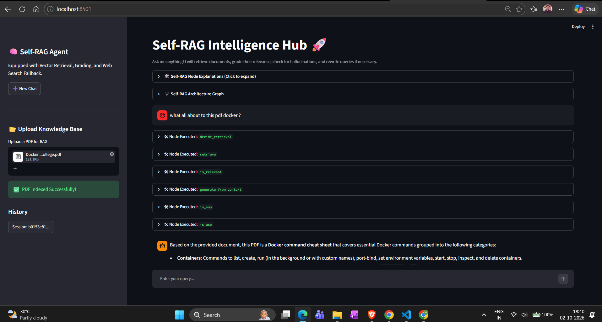
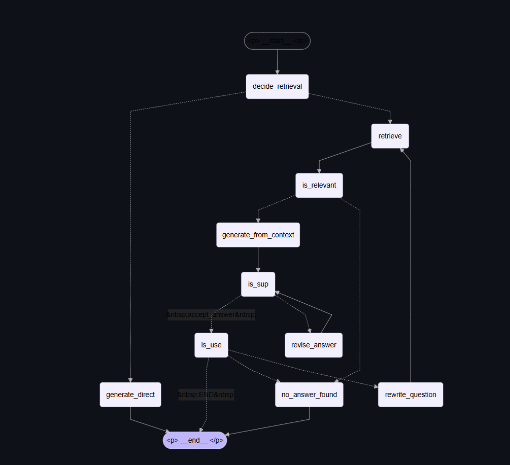
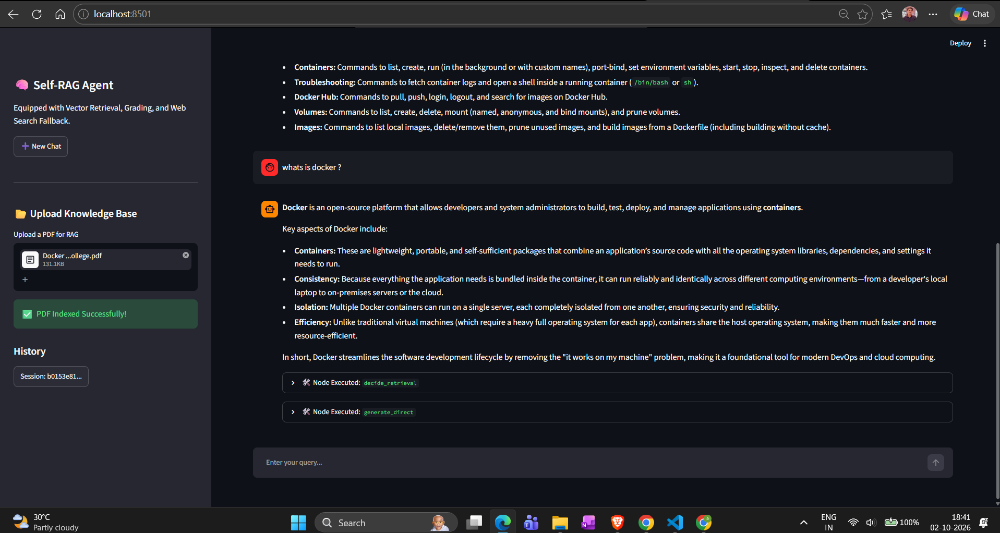
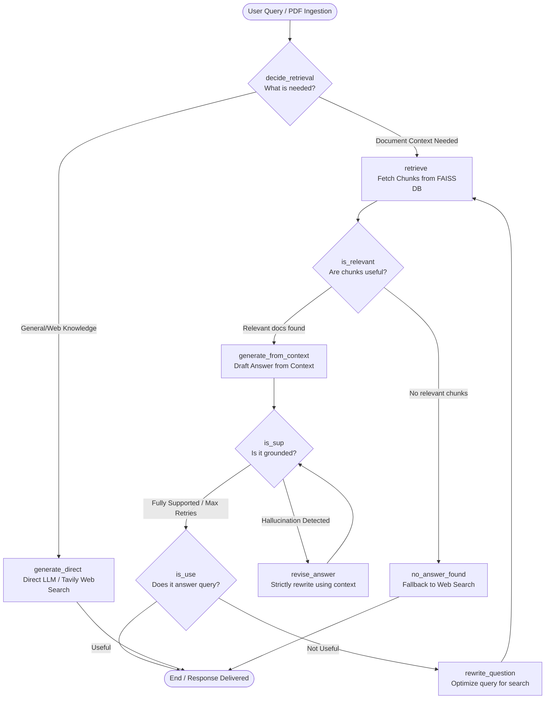

# 🧠 Self-RAG Intelligence Hub

An advanced **Self-RAG (Self-Reflective Retrieval-Augmented Generation)** conversational application built with **LangGraph**, **Streamlit**, **FAISS**, and **Google Gemini**.

This system moves beyond traditional RAG by introducing self-critique loops. It dynamically evaluates whether external retrieval is needed, filters out irrelevant document chunks, checks generated outputs for hallucinations, and automatically rewrites queries or falls back to web search if the local knowledge base falls short.


---

## 📸 Screenshots

### 🖥️ Application Dashboard



*Streamlit interface for interacting with the Self-RAG Intelligence Hub.*

### 🧠 Architecture & Workflow



*LangGraph workflow showing retrieval, relevance grading, hallucination checking, and query rewriting.*

### 🔍 Agent Execution / Results



*Live agent execution showing the Self-RAG reasoning and retrieval workflow.*

---

## 🏗️ Architecture & Node Graph

The system executes a deterministic and reflective state machine using **LangGraph**. Below is the structural flow illustrating how user queries are processed, evaluated, and refined.



---

## ❓ The "WH-" Node Explanation Guide

| Node Name                       | What it does                                                                                                  | How it works                                                                                                                              | Why it's used                                                                            |
| ------------------------------- | ------------------------------------------------------------------------------------------------------------- | ----------------------------------------------------------------------------------------------------------------------------------------- | ---------------------------------------------------------------------------------------- |
| **`decide_retrieval`**          | **What:** The routing controller. <br><br>**Who:** Triggered first for every prompt.                          | Uses structured LLM outputs to evaluate if the query requires facts from uploaded local documents or can be answered natively.            | Prevents unnecessary vector database searches for general chit-chat or common knowledge. |
| **`retrieve`**                  | **What:** The document fetcher. <br><br>**Who:** Activated when documents are uploaded and queried.           | Queries the session-specific FAISS vector store using semantic chunk indexing to grab top matching passages.                              | Pulls raw external text context into the graph state pipeline.                           |
| **`is_relevant`**               | **What:** The context filter. <br><br>**Who:** Evaluates every retrieved text chunk.                          | Passes individual documents and the user question through a relevance grader LLM.                                                         | Eliminates noise and ensures off-topic chunks don't pollute the generation step.         |
| **`generate_from_context`**     | **What:** The grounded writer. <br><br>**Who:** Called when relevant chunks pass inspection.                  | Synthesizes an answer constrained strictly to the verified document context.                                                              | Forms the core RAG answer generation component.                                          |
| **`is_sup` (Support Check)**    | **What:** The hallucination checker. <br><br>**Who:** Evaluates the drafted answer against source texts.      | Checks if every claim in the response is explicitly supported by the retrieved context chunks, triggering a revision loop if unsupported. | Drastically reduces AI hallucinations and fabricated facts.                              |
| **`is_use` (Usefulness Check)** | **What:** The quality validator. <br><br>**Who:** Assesses the final output against the original user prompt. | Judges whether the answer actually solves the user's core problem or intent.                                                              | Decides whether the pipeline can safely stop or if it needs to dig deeper.               |
| **`rewrite_question`**          | **What:** The query optimizer. <br><br>**Who:** Triggered when an answer is deemed unhelpful.                 | Transforms poor or vague search queries into optimized phrasing and loops back to retrieval.                                              | Rescues failed searches by trying alternative semantic keywords.                         |
| **`no_answer_found`**           | **What:** The safety net. <br><br>**Who:** Activated when local documents fail.                               | Automatically falls back to Tavily Web Search or general LLM reasoning.                                                                   | Ensures the user never hits a dead end if their uploaded file lacks the answer.          |

---

## 📂 Project Directory Structure

```text
self-rag-intelligence-hub/
│
├── assets/                    # Visual assets and UI screenshots
│   ├── architecture.png       # Pipeline workflow graphic
│   └── dashboard_preview.png  # Streamlit app interface preview
│
├── langgraph_backend.py       # Core LangGraph state machine, FAISS, and SQLite DB
├── langgraph_frontend.py      # Streamlit user interface and session management
├── requirements.txt           # Python dependencies
├── .env                       # API keys (GEMINI_API_KEY, TAVILY_API_KEY)
└── README.md                  # Project documentation
```

---

## 🚀 Getting Started

### 1. Clone & Setup Environment

Ensure you have Python 3.10+ installed. Clone this repository and create a virtual environment:

```bash
git clone https://github.com/your-username/self-rag-intelligence-hub.git
cd self-rag-intelligence-hub

python -m venv venv
source venv/bin/activate  # On Windows: venv\Scripts\activate
```

### 2. Install Dependencies

```bash
pip install -r requirements.txt
```

### 3. Configure Environment Variables

Create a `.env` file in the root directory and add your API credentials:

```env
GEMINI_API_KEY=your_google_gemini_api_key_here
TAVILY_API_KEY=your_tavily_api_key_here  # Optional, enables web search fallback
```

### 4. Run the Application

Launch the Streamlit frontend interface:

```bash
streamlit run langgraph_frontend.py
```

---

## 💡 How to Use

1. **Upload a Knowledge Base:** Use the sidebar on the Streamlit dashboard to upload any `.pdf` document. The system will automatically chunk via Semantic Chunkers and index it into FAISS.
2. **Inspect Architecture:** Expand the **Self-RAG Node Explanations** and **Architecture Graph** dropdowns to monitor how nodes execute live.
3. **Chat Interactively:** Ask questions. Expand the tool execution traces to watch the graph grade document relevance, check for hallucinations, and rewrite queries in real time.
